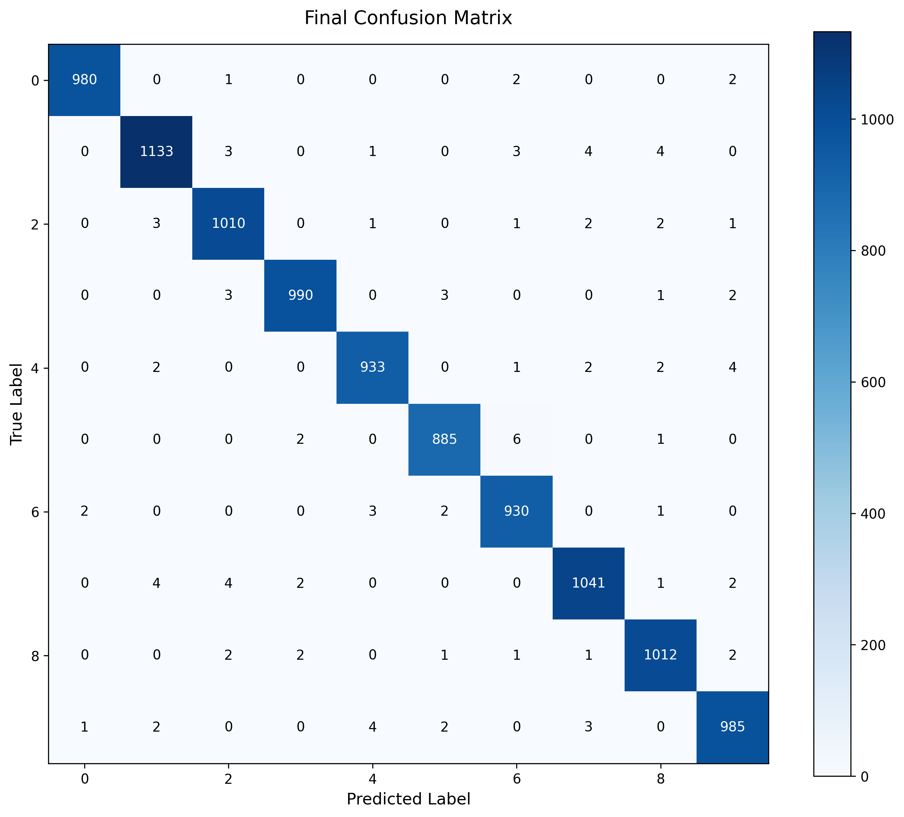

# MNIST Deep Neural Network with CI/CD

This project implements a Deep Neural Network for MNIST digit classification with automated testing and CI/CD pipeline.

## Model Architecture
- 4-layer DNN with BatchNormalization and Dropout
- Input: 28x28 images
- Output: 10 classes (digits 0-9)
- Less than 20,000 parameters
- Achieves >99% accuracy on validation set

## Project Structure 

-project/
├── .github/workflows/ # CI/CD configuration
├── src/ # Source code
│ ├── model.py # Model architecture
│ ├── train.py # Training script
│ └── test_model.py # Model tests
├── requirements.txt # Dependencies
└── README.md

## Local Setup and Running

1. Create a virtual environment:
bash
python -m venv venv
source venv/bin/activate # On Windows: venv\Scripts\activate

2. Install dependencies:
bash
pip install -r requirements.txt

3. Run tests locally:
bash
cd src
python -m pytest test_model.py -v

4. Train the model:
bash
cd src
python train.py

## CI/CD Pipeline

The GitHub Actions workflow automatically:
1. Runs all tests on push/PR to main branch
2. Validates model architecture
3. Checks parameter count
4. Verifies BatchNorm and Dropout usage

## Model Artifacts

Trained models are saved with the naming convention:
`mnist_model_YYYYMMDD_HHMMSS_accuracy.pth`

## Tests

The following tests are implemented:
1. Total Parameter Count Test (<20,000)
2. Batch Normalization Usage
3. Dropout Layer Usage
4. Input/Output Shape Validation

## GitHub Setup

1. Create a new repository
2. Clone this project
3. Push to your repository:

bash
git init
git add .
git commit -m "Initial commit"
git remote add origin <your-repo-url>
git push -u origin main

The CI/CD pipeline will automatically run on push to main branch.

This implementation includes:

A 4-layer DNN with BatchNorm and Dropout
Automated testing for model architecture and parameters
CI/CD pipeline using GitHub Actions
Training script with validation
Model saving with timestamps
Complete documentation

To run locally:
1.Create a virtual environment
2.Install requirements
3.Run tests
4.Train model

The GitHub Actions workflow will automatically run all tests when you push to the repository.
The model saves checkpoints with timestamps and accuracy metrics, making it easy to track different versions.
All test cases are implemented in test_model.py and will be run both locally and in the CI/CD pipeline.

Using device: cuda

Training Progress:
--------------------------------------------------------------------------------
Epoch 1/20 [Train]: 100%|█| 782/782 [00:12<00:00, 63.50it/s, loss=0.3886, acc=87.51%]
Epoch 1/20 [Valid]: 100%|█| 157/157 [00:05<00:00, 26.76it/s, loss=0.0933, acc=97.44%]

Epoch 1 Summary:
Train Loss: 0.3881, Train Acc: 87.51%
Val Loss: 0.0933, Val Acc: 97.44%
--------------------------------------------------------------------------------
Saved best model checkpoint: mnist_model_20241126_212545_97.44.pth
Epoch 2/20 [Train]: 100%|█| 782/782 [00:13<00:00, 59.57it/s, loss=0.1156, acc=96.67%]
Epoch 2/20 [Valid]: 100%|█████████████████| 157/157 [00:05<00:00, 26.25it/s, loss=0.0736, acc=98.36%]

Epoch 2 Summary:
Train Loss: 0.1153, Train Acc: 96.67%
Val Loss: 0.0600, Val Acc: 98.36%
--------------------------------------------------------------------------------
Saved best model checkpoint: mnist_model_20241126_212604_98.36.pth
Epoch 3/20 [Train]: 100%|█████████████████| 782/782 [00:13<00:00, 57.69it/s, loss=0.0867, acc=97.62%] 
Epoch 3/20 [Valid]: 100%|█████████████████| 157/157 [00:06<00:00, 25.50it/s, loss=0.0651, acc=98.42%] 

Epoch 3 Summary:
Train Loss: 0.0865, Train Acc: 97.62%
Val Loss: 0.0614, Val Acc: 98.42%
--------------------------------------------------------------------------------
Saved best model checkpoint: mnist_model_20241126_212623_98.42.pth
Epoch 4/20 [Train]: 100%|█████████████████| 782/782 [00:12<00:00, 63.14it/s, loss=0.0730, acc=98.01%] 
Epoch 4/20 [Valid]: 100%|█████████████████| 157/157 [00:05<00:00, 27.12it/s, loss=0.0480, acc=98.82%] 

Epoch 4 Summary:
Train Loss: 0.0730, Train Acc: 98.01%
Val Loss: 0.0464, Val Acc: 98.82%
--------------------------------------------------------------------------------
Saved best model checkpoint: mnist_model_20241126_212642_98.82.pth
Epoch 5/20 [Train]: 100%|█████████████████| 782/782 [00:12<00:00, 64.23it/s, loss=0.0655, acc=98.26%] 
Epoch 5/20 [Valid]: 100%|█████████████████| 157/157 [00:05<00:00, 27.15it/s, loss=0.0403, acc=98.89%]
--------------------------------------------------------------------------------
Saved best model checkpoint: mnist_model_20241126_212700_98.89.pth
Epoch 6/20 [Train]: 100%|█████████████████| 782/782 [00:12<00:00, 61.76it/s, loss=0.0549, acc=98.54%] 
Epoch 6/20 [Valid]: 100%|█████████████████| 157/157 [00:06<00:00, 24.93it/s, loss=0.0489, acc=98.92%] 

Epoch 6 Summary:
Train Loss: 0.0546, Train Acc: 98.54%
Val Loss: 0.0401, Val Acc: 98.92%
--------------------------------------------------------------------------------
Saved best model checkpoint: mnist_model_20241126_212719_98.92.pth
Epoch 7/20 [Train]: 100%|█████████████████| 782/782 [00:12<00:00, 61.39it/s, loss=0.0520, acc=98.55%] 
Epoch 7/20 [Valid]: 100%|█████████████████| 157/157 [00:06<00:00, 25.29it/s, loss=0.0524, acc=98.86%] 

Epoch 7 Summary:
Train Loss: 0.0513, Train Acc: 98.55%
Val Loss: 0.0477, Val Acc: 98.86%
--------------------------------------------------------------------------------
Epoch 8/20 [Train]: 100%|█████████████████| 782/782 [00:12<00:00, 64.30it/s, loss=0.0491, acc=98.64%] 
Epoch 8/20 [Valid]: 100%|█████████████████| 157/157 [00:06<00:00, 25.86it/s, loss=0.0566, acc=98.65%]

Epoch 8 Summary:
Train Loss: 0.0484, Train Acc: 98.64%
Val Loss: 0.0540, Val Acc: 98.65%.
--------------------------------------------------------------------------------
Epoch 9/20 [Train]: 100%|█████████████████| 782/782 [00:12<00:00, 63.39it/s, loss=0.0438, acc=98.77%] 
Epoch 9/20 [Valid]: 100%|█████████████████| 157/157 [00:05<00:00, 26.64it/s, loss=0.0376, acc=99.05%] 

Epoch 9 Summary:
Train Loss: 0.0435, Train Acc: 98.77%
Val Loss: 0.0357, Val Acc: 99.05%
--------------------------------------------------------------------------------
Saved best model checkpoint: mnist_model_20241126_212814_99.05.pth
Epoch 10/20 [Train]: 100%|████████████████| 782/782 [00:12<00:00, 62.73it/s, loss=0.0356, acc=99.01%] 
Epoch 10/20 [Valid]: 100%|████████████████| 157/157 [00:06<00:00, 25.03it/s, loss=0.0431, acc=99.09%]

Epoch 10 Summary:
Train Loss: 0.0354, Train Acc: 99.01%
Val Loss: 0.0365, Val Acc: 99.09%
--------------------------------------------------------------------------------
Saved best model checkpoint: mnist_model_20241126_212833_99.09.pth
Epoch 11/20 [Train]: 100%|████████████████| 782/782 [00:12<00:00, 64.10it/s, loss=0.0363, acc=99.06%] 
Epoch 11/20 [Valid]: 100%|████████████████| 157/157 [00:06<00:00, 25.98it/s, loss=0.0601, acc=98.77%] 

Epoch 11 Summary:
Train Loss: 0.0361, Train Acc: 99.06%
Val Loss: 0.0501, Val Acc: 98.77%
--------------------------------------------------------------------------------
Epoch 12/20 [Train]: 100%|████████████████| 782/782 [00:12<00:00, 64.56it/s, loss=0.0343, acc=99.05%] 
Epoch 12/20 [Valid]: 100%|████████████████| 157/157 [00:06<00:00, 25.73it/s, loss=0.0423, acc=99.06%] 

Epoch 12 Summary:
Train Loss: 0.0341, Train Acc: 99.05%
Val Loss: 0.0382, Val Acc: 99.06%
--------------------------------------------------------------------------------
Epoch 13/20 [Train]: 100%|████████████████| 782/782 [00:12<00:00, 65.08it/s, loss=0.0334, acc=99.06%] 
Epoch 13/20 [Valid]: 100%|████████████████| 157/157 [00:05<00:00, 26.62it/s, loss=0.0378, acc=99.14%] 

Epoch 13 Summary:
Train Loss: 0.0330, Train Acc: 99.06%
Val Loss: 0.0347, Val Acc: 99.14%
--------------------------------------------------------------------------------
Saved best model checkpoint: mnist_model_20241126_212927_99.14.pth
Epoch 14/20 [Train]: 100%|████████████████| 782/782 [00:12<00:00, 63.47it/s, loss=0.0304, acc=99.17%] 
Epoch 14/20 [Valid]: 100%|████████████████| 157/157 [00:06<00:00, 25.53it/s, loss=0.0330, acc=99.14%] 

Epoch 14 Summary:
Train Loss: 0.0301, Train Acc: 99.17%
Val Loss: 0.0326, Val Acc: 99.14%
--------------------------------------------------------------------------------
Epoch 15/20 [Train]: 100%|████████████████| 782/782 [00:12<00:00, 63.39it/s, loss=0.0293, acc=99.17%] 
Epoch 15/20 [Valid]: 100%|████████████████| 157/157 [00:06<00:00, 25.14it/s, loss=0.0400, acc=99.07%] 

Epoch 15 Summary:
Train Loss: 0.0291, Train Acc: 99.17%
Val Loss: 0.0385, Val Acc: 99.07%
--------------------------------------------------------------------------------
Epoch 16/20 [Train]: 100%|████████████████| 782/782 [00:13<00:00, 57.32it/s, loss=0.0269, acc=99.23%] 
Epoch 16/20 [Valid]: 100%|████████████████| 157/157 [00:06<00:00, 24.11it/s, loss=0.0527, acc=99.10%] 

Epoch 16 Summary:
Train Loss: 0.0267, Train Acc: 99.23%
Val Loss: 0.0429, Val Acc: 99.10%
--------------------------------------------------------------------------------
Epoch 17/20 [Train]: 100%|████████████████| 782/782 [00:12<00:00, 63.35it/s, loss=0.0259, acc=99.29%] 
Epoch 17/20 [Valid]: 100%|████████████████| 157/157 [00:05<00:00, 26.88it/s, loss=0.0387, acc=99.09%] 

Epoch 17 Summary:
Train Loss: 0.0256, Train Acc: 99.29%
Val Loss: 0.0382, Val Acc: 99.09%
--------------------------------------------------------------------------------
Epoch 18/20 [Train]: 100%|████████████████| 782/782 [00:12<00:00, 63.52it/s, loss=0.0243, acc=99.33%] 
Epoch 18/20 [Valid]: 100%|████████████████| 157/157 [00:06<00:00, 25.03it/s, loss=0.0451, acc=99.08%] 

Epoch 18 Summary:
Train Loss: 0.0240, Train Acc: 99.33%
Val Loss: 0.0385, Val Acc: 99.08%
--------------------------------------------------------------------------------
Epoch 19/20 [Train]: 100%|████████████████| 782/782 [00:12<00:00, 61.65it/s, loss=0.0204, acc=99.40%] 
Epoch 19/20 [Valid]: 100%|████████████████| 157/157 [00:05<00:00, 26.76it/s, loss=0.0367, acc=99.22%] 

Epoch 19 Summary:
Train Loss: 0.0202, Train Acc: 99.40%
Val Loss: 0.0358, Val Acc: 99.22%
--------------------------------------------------------------------------------
Saved best model checkpoint: mnist_model_20241126_213120_99.22.pth
Epoch 20/20 [Train]: 100%|████████████████| 782/782 [00:12<00:00, 63.71it/s, loss=0.0213, acc=99.43%] 
Epoch 20/20 [Valid]: 100%|████████████████| 157/157 [00:05<00:00, 26.30it/s, loss=0.0418, acc=99.08%] 

Epoch 20 Summary:
Train Loss: 0.0211, Train Acc: 99.43%
Val Loss: 0.0405, Val Acc: 99.08%
--------------------------------------------------------------------------------

Training completed!
Best validation accuracy: 99.22%

